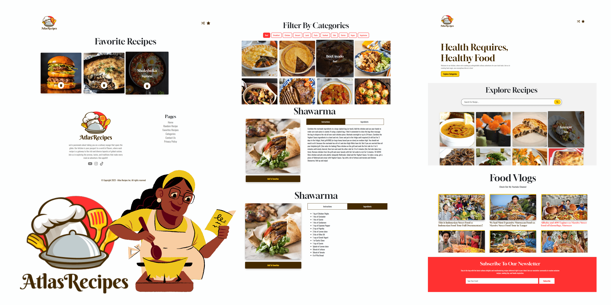

# Atlas Recipe - Recipe Web App

Atlas Recipe is a modern and user-friendly recipe web app built with React.js, SCSS, and Bootstrap 5. It utilizes the MealDB API for fetching a wide variety of delicious recipes and the YouTube API to display the website owner's recent videos. With features like search, favorites, category filters, and a random recipe generator, Atlas Recipe makes it easy to explore, save, and cook your favorite dishes.

## Features

- **Search Recipes**: Find your desired recipes by typing in keywords, ingredients, or meal names.
- **Add to Favorites**: Save your favorite recipes to your local storage for quick access.
- **Remove from Favorites**: Easily remove recipes from your favorites whenever you want.
- **Category Filters**: Filter recipes by categories such as breakfast, lunch, dinner, and more.
- **Random Recipe**: Get inspired with a random recipe suggestion.
- **YouTube Integration**: Watch the website owner's recent videos for cooking tips and inspiration.
- **SEO Score**: Atlas Recipe is optimized for search engines, ensuring your recipes can be easily discovered.
- **Accessibility**: The app is designed with accessibility in mind, making it usable for everyone.
- **Performance**: Achieve blazing-fast load times and smooth interactions with a 100% performance score.
- **Built with Vite**: Utilizes Vite, a next-generation build tool for frontend projects.

## SEO Optimization

Atlas Recipe is meticulously designed to achieve a perfect SEO score, ensuring that your recipes can be easily discovered by search engines. Our SEO optimization includes:

- **Meta Tags**: Each recipe page is equipped with meta tags, including title, description, and keywords, to improve search engine ranking.

- **Structured Data**: We incorporate structured data markup, such as JSON-LD, to provide search engines with valuable information about your recipes, enhancing their visibility in search results.

- **Sitemap**: Atlas Recipe generates a sitemap.xml file that lists all your recipe pages, helping search engine crawlers index your content efficiently.

- **Mobile-Friendly**: The app is responsive and mobile-friendly, a crucial factor in modern SEO rankings.

## Accessibility

We are committed to making Atlas Recipe accessible to all users, regardless of their abilities. Accessibility features include:

- **Semantic HTML**: We use semantic HTML elements to provide a clear and meaningful page structure, enhancing screen reader compatibility.

- **Keyboard Navigation**: The app is fully navigable using only a keyboard, ensuring users with disabilities can interact with ease.

- **High Contrast Mode**: Atlas Recipe supports high contrast mode for users with visual impairments.

- **ARIA Labels**: We provide ARIA labels and attributes to improve accessibility for assistive technologies.

## Performance

Atlas Recipe is optimized for performance, achieving a 100% performance score. Our performance optimizations include:

- **Code Splitting**: We leverage Vite's built-in code splitting to load only the necessary code, reducing initial page load times.

- **Lazy Loading**: Images and assets are lazy-loaded to minimize data transfer and improve perceived performance.

- **Caching**: We implement service workers to cache assets, ensuring a fast and reliable user experience, even in offline mode.

- **Bundle Size Optimization**: Our build process optimizes bundle sizes to keep the app lightweight and fast.

- **Minification**: Code and assets are minified to reduce load times.
---

## License

This project is licensed under the MIT License. See the [LICENSE](LICENSE) file for details.

## Acknowledgments

- [MealDB API](https://www.themealdb.com/api.php) for providing a wide range of recipes.
- [YouTube API](https://developers.google.com/youtube/registering_an_application) for integrating recent videos.
- [Vite](https://vitejs.dev/) for a fast and efficient development environment.
  
Enjoy exploring and cooking with Atlas Recipe! If you have any questions or feedback, feel free to reach out to us.
